# Proyecto de Procesamiento de Datos con Kafka y Conectores

#### **Realizado por Angelica Pineda**

Este repositorio contiene la documentación y configuración para el entorno de procesamiento de datos utilizando Kafka, Kafka Connect, KSQLDB y aplicaciones de Streams.

## Configuración del Entorno


### 1. Ejecución del Setup
Para iniciar el entorno, se utiliza el script de configuración:
```sh
./setup.sh
```
Este comando levanta los servicios necesarios y realiza las configuraciones iniciales como la creación de tablas en MySQL e instalación de conectores.

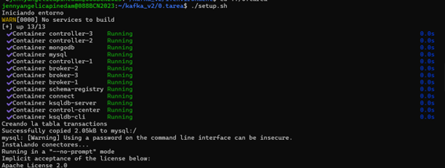

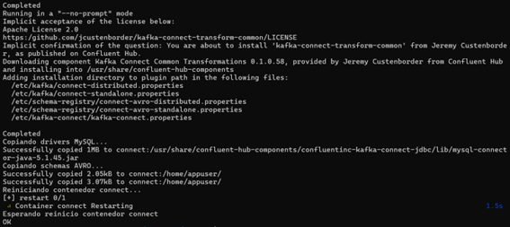

### 2. Revisión de Contenedores
Se debe verificar que todos los servicios (broker, schema-registry, connect, mongodb, mysql, etc.) estén en estado "Running":
```bash
docker ps
```
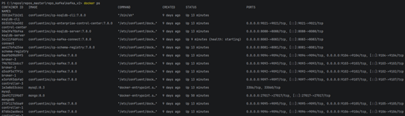
---

## Tarea 1: Ingesta de Sensores (Datagen)

### Configuración del Esquema
Se define el esquema Avro en el archivo "sensor-telemetry.avsc" basado en los requerimientos del proyecto.

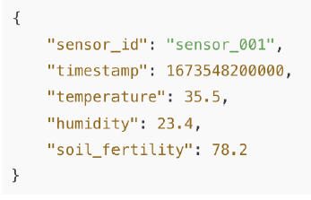

Para que el conector pueda utilizarlo, el archivo se copia al contenedor de "connect":
```bash
docker cp ./0.tarea/datagen/sensor-telemetry.avsc connect:/home/appuser/sensor-telemetry.avsc
```
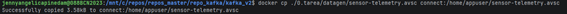

### Ejecución del Conector
1. Se revisan los plugins disponibles:
   ```bash
   curl http://localhost:8083/connector-plugins | jq
   ```

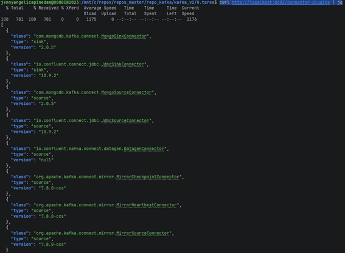

2. Se utiliza el plugin "io.confluent.kafka.connect.datagen.DatagenConnector" para generar datos de telemetría.

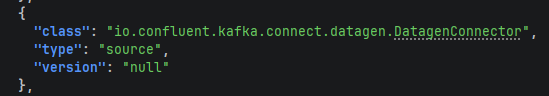 

codigo del conector:

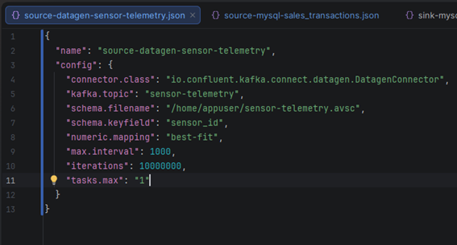

3. Se lanzan los conectores mediante el script:
   ```bash
   ./start_connectors.sh
   ```
   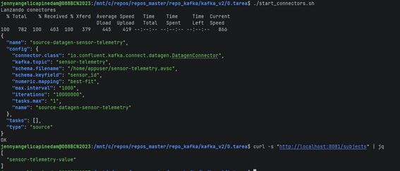


### Verificación
Se puede verificar el registro del esquema y la recepción de mensajes:
```bash
# Ver subjects registrados
curl -s "http://localhost:8081/subjects" | jq

# Consumir mensajes Avro
docker exec -it schema-registry kafka-avro-console-consumer --bootstrap-server broker-1:29092 --topic sensor-telemetry --from-beginning --max-messages 5 --property schema.registry.url=http://localhost:8081
```
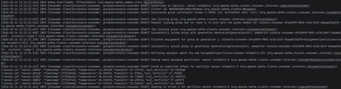

Al revisar en control-center el topic se ve asi:

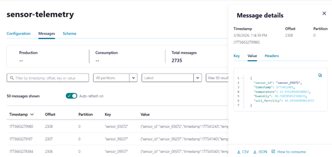

Tambien se puede ver el esquema asignado con ID:1 el tipo de compatibilidad definido “Backward” y los detalles de cada campo.

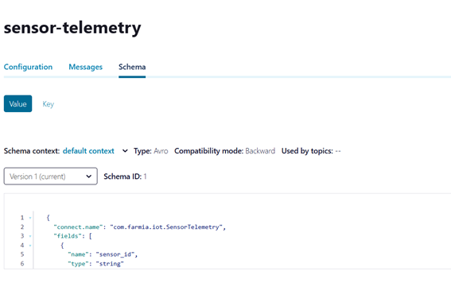

---

## Tarea 2: Ingesta desde MySQL (Source Connector)

El flujo de datos para esta tarea es el siguiente:
1. **Source Datagen**: Genera datos en el topic "_transactions".
2. **Sink MySQL**: Lleva los datos del topic a la tabla "sales_transactions" en MySQL.
3. **Source MySQL**: Lee de la tabla MySQL y guarda en el topic "sales-transactions" de Kafka.

Para esto es necesario generar el código del conector a MySQL usando el plugin “io.confluent.connect.jdbc.JdbcSourceConnector” de tipo source:

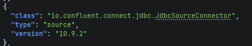

El proceso detallado se realizo primero generando los datos dentro de la tabla con el conector “source-datagen-_transactions.json” que genera datos en el topic “_transactions” que luego se llevaran a MySQL con el conector “sink-mysql-_transactions.json” que toma los datos del topic “_transactions” y lo lleva a la tabla “sales_transactions” dentro de MySQL, por último el conector “source-mysql-sales_transactions.json” traerá los datos de la tabla mencionada anteriormente para guardarlos dentro del topic “sales-transactions”.

Primero se ejecutará el conector source-datagen-_transactions.json”, usando el archivo start_connectors.sh así:

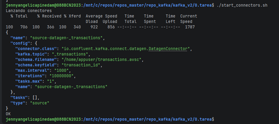

Al verificar en control-center el topic “_transactions” se ha creado y contiene los mensajes autogenerados:

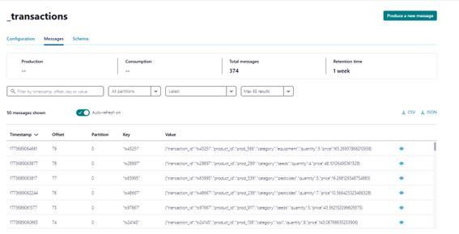

El siguiente paso es ejecutar el conector sink “sink-mysql-_transactions.json” que llevara los datos a MySQL a la tabla “sales_transactions”así:

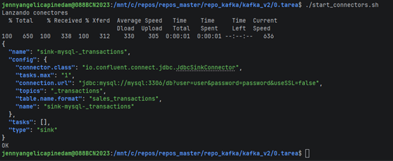

Por ultimo se configura el tercer conector que trae los datos de la tabla “sales_transactions” de MySQL al topic “sales-transactions” en Kafka. 
Para esto es necesario configurar propiedades adicionales como el modo de lectura de la tabla que será por “timestamp”, las transformaciones para la creación de la key y el cambio del nombre para topic, entre otros.
El ejecutar el conector “source-mysql-sales_transactions.json” se ve el siguiente resultado:


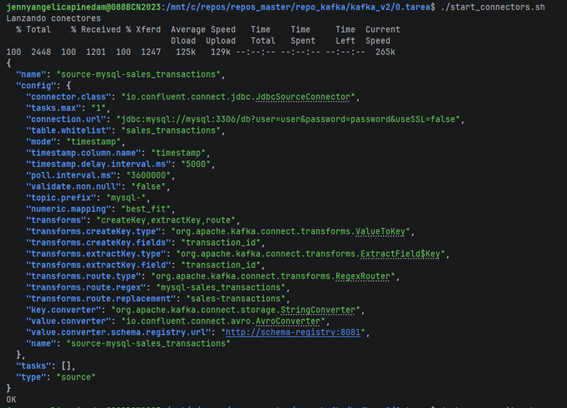

Al revisar el topic “sales-transactions” en control center se comprueba que ha traído los registros correctamente.

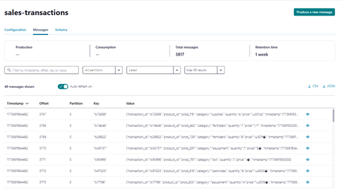

---

## Tarea 3: Creación de la Aplicación Sensor Alerter App

### Configuración
- **Java**: Se utiliza la versión 17. 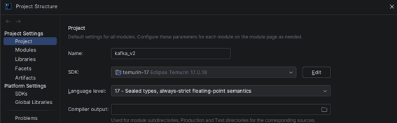 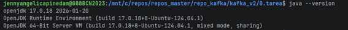
- **Avro**: Los esquemas se ubican en "src/main/avro". 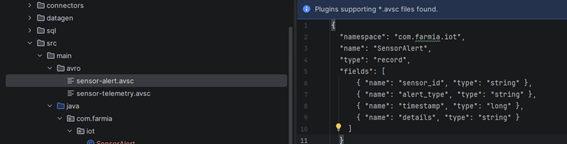
- **Ajustes adicionales**: 
- 1.	Dentro del archivo pom-xml del proyecto general se configuro la versión de java, esto para evitar errores de ejecución 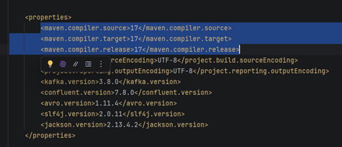 
1. 2.	Además se agregó en el pom.xml de la carpeta 0.tarea el plugin de avro para permitir que Maven busque los archivos .avsc en la ruta src/main/avro.  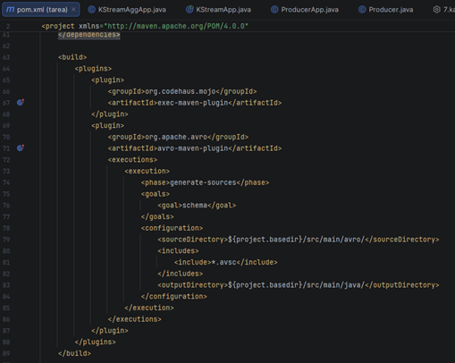 
- 3.	Tambien se agrego la carpeta resources con el archivo streams.properties y la clase ConfigLoader dentro de la carpeta src\main\java\com\farmia\streaming para ser usada luego en la generación de la app. 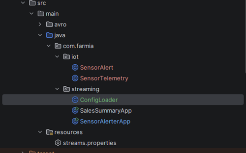
- Al ejecutar "mvn clean compile", Maven genera las clases correspondientes.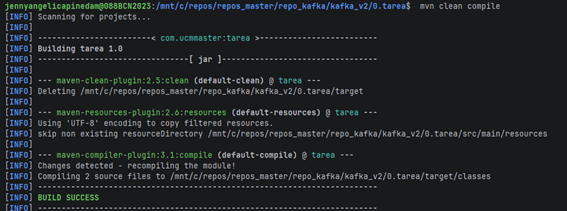 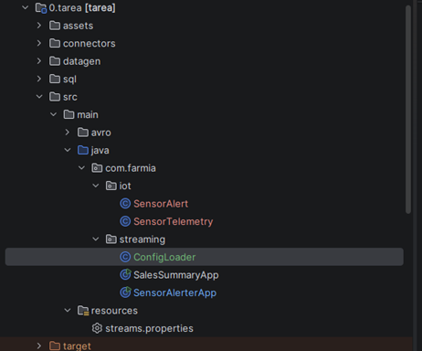


### Lógica de la Aplicación
La aplicación filtra mensajes basándose en:
- Temperatura > 35ºC
- Humedad < 20%

A partir de esto se genera un mensaje dentro del topic varía el tipo de alerta y el detalle del mensaje de acuerdo con la condición if. Tambien se agregó una operación peek para alertar de los mensajes que van llegando al topic junto con el id de sensor registrado
  Los mensajes filtrados se envían al topic "sensor-alerts" con el detalle del tipo de alerta.El código se encuentra en: "src/main/java/com/farmia/streaming/SensorAlerterApp.java".

La siguiente imagen muestra la aplicación siendo ejecutada mientras se van recibiendo logs de los mensajes que se registran.
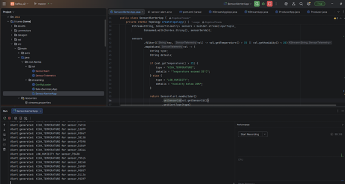

Además, en Control-center también se puede consultar los mensajes que van llegando al topic sensor-alerts.

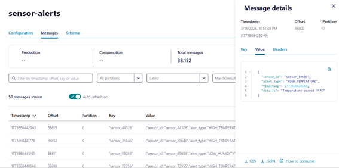

La siguiente es una imagen del sensor del que consume los mensajes (sensor-telemetry) donde se evidencia la diferencia de mensajes entre uno y otro lo que evidencia el filtrado.

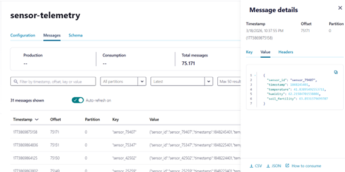


---

## Tarea 4: Creación de la Aplicación Sales Summary App

### Opción KStreams 

Para la realización de la aplicación se añadieron los otros dos esquemas a la carpeta src\main\avro, sales-summary.avsc y transactions.avsc, a partir de esto y con el comando mvn clean compile se generaron las clases dentro de su ruta de paquete src\main\java\com\farmia\sales como se muestra a continuación:

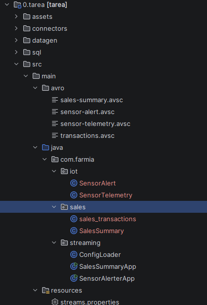

Las clases que se generan automáticamente se importan dentro de la aplicación para ser utilizadas, tal y como se realizo con la anterior aplicación.

Luego se genero el código de la aplicación dentro del fichero src\main\java\com\farmia\streaming\SalesSummaryApp.java, dentro de la clase especifica el tipo de esquema que será usado para la serialización y deserialización, tanto para el topic de entrada como de salida, luego se genera el código de agregación usando la lógica de preagrupacion por categoría del topic de origen sales-transactions.

**Nota:** Se realizo el cambio en la definición de la key dentro de la configuración del conector connectors\source-mysql-sales_transactions.json con el fin de facilitar la agregación en la aplicación.

Luego se aplicó la ventana de 1 minuto con windowedBy(), y luego se paso a generar la agregación para las cantidades y suma del precio de esas cantidades. 
Una vez aplicada la agregación se aplicó una operación .tostream() para pasar de ktable a kstream, se aplicó map para asignar los valores a los campos de destino y luego un peek() que va muestra los mensajes que se van procesando para pasar al topic destino.

A pesar de esto, se encontraron problemas de serialización que no fueron posibles de arreglar, a continuación, se muestran evidencias de la ejecución fallida y algunos de los mensajes de error en la serialización:

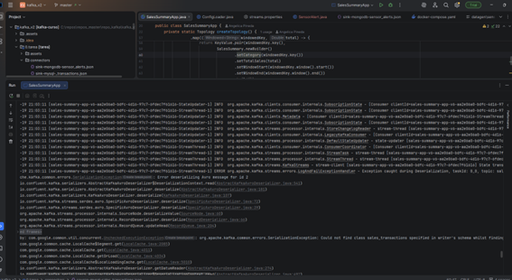

org.apache.kafka.common.errors.SerializationException: Error deserializing Avro message for id 2
Caused by: com.google.common.util.concurrent.UncheckedExecutionException: org.apache.kafka.common.errors.SerializationException: Could not find class sales_transactions specified in writer's schema whilst finding reader's schema for a SpecificRecord.

Como resultado se optó por desarrollar el ejercicio utilizando KSQLDB


### Opción KSqlDB (Solución implementada)

Debido a los problemas de serialización y esquemas se recurre a usar KSqlDB con el fin de cumplir con el objetivo de la practica y generar un topic sales-summary que agrupe por categoría y calcule el total de ingresos con intervalos de 1 minuto.

**Pasos ejecutados:**
1. Acceso al CLI de KsqlDB:
   ```bash
   docker exec -it ksqldb-cli ksql http://ksqldb-server:8088
   ```
2. Creación del Stream de entrada desde "sales-transactions".
3. Creación de la tabla de agregación donde se asigna el nombre que llevara el topic y el formato de esquema con el que se guardara, luego la operación de agrupación con las columnas y la ventana de tiempo de 1 minuto.

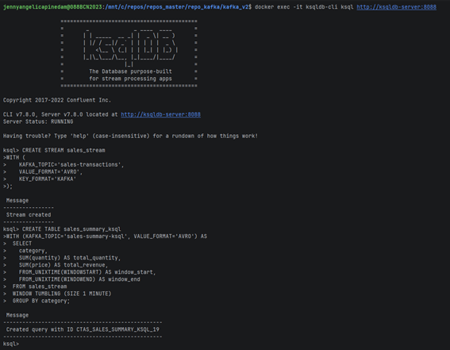

Como evidencia del resultado se consulta a la tabla previamente creada sales_summary_ksql así:

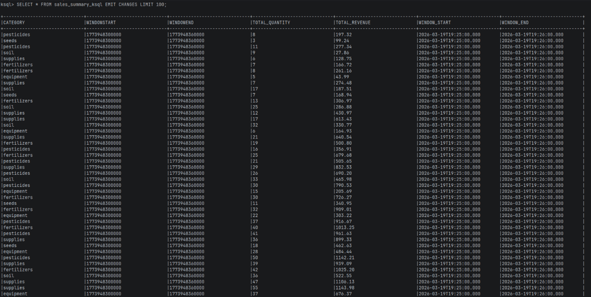

Y dentro del topic en control – center se ve así:

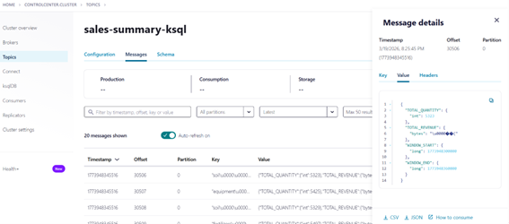

---

## Tarea 5: Conexión con MongoDB

Se configuró un conector de tipo **Sink** para MongoDB que consume datos del topic "sensor-alerts" basándose en el archivo "connectors/sink-mongodb-sensor_alerts.json".

Esta es la ejecucion del conector:

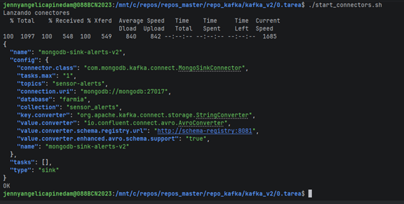

### Verificación de Estado del conector
```bash
curl -s http://localhost:8083/connectors/mongodb-sink-alerts-v2/status | jq
```
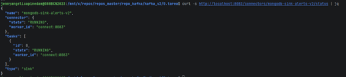

Se evidencia que el conector y la task están en estado running.


### Consulta en MongoDB
Para verificar la inserción de datos:
```bash
docker exec -it mongodb mongosh
use farmia;
db.sensor_alerts.find();
```
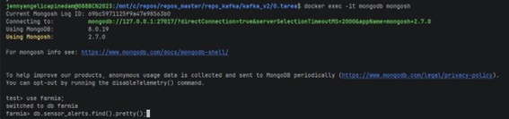